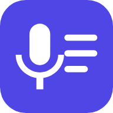
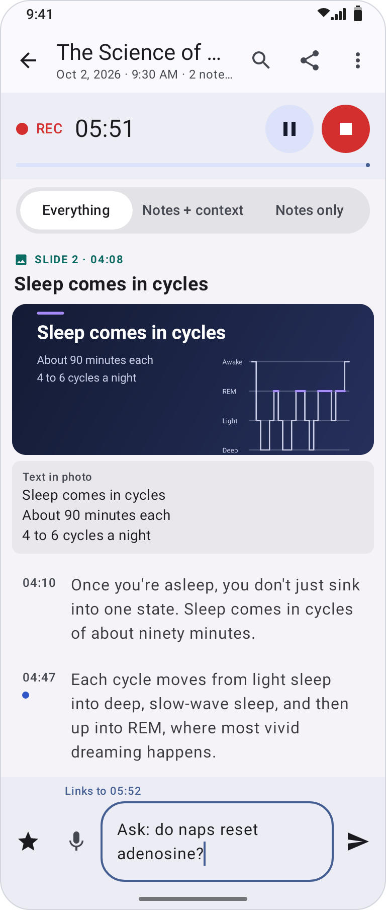
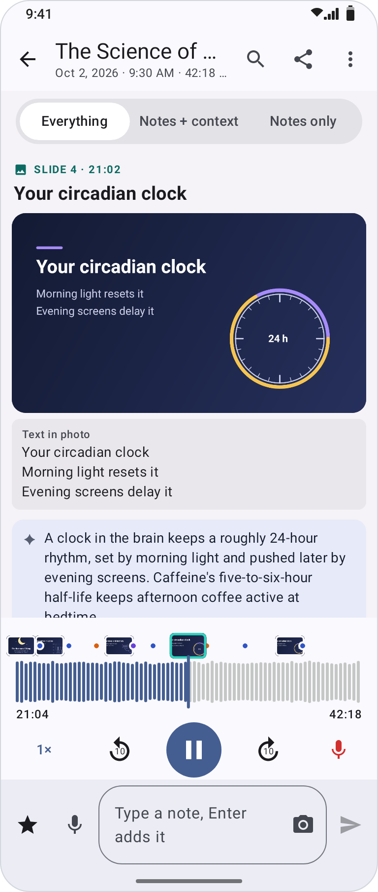
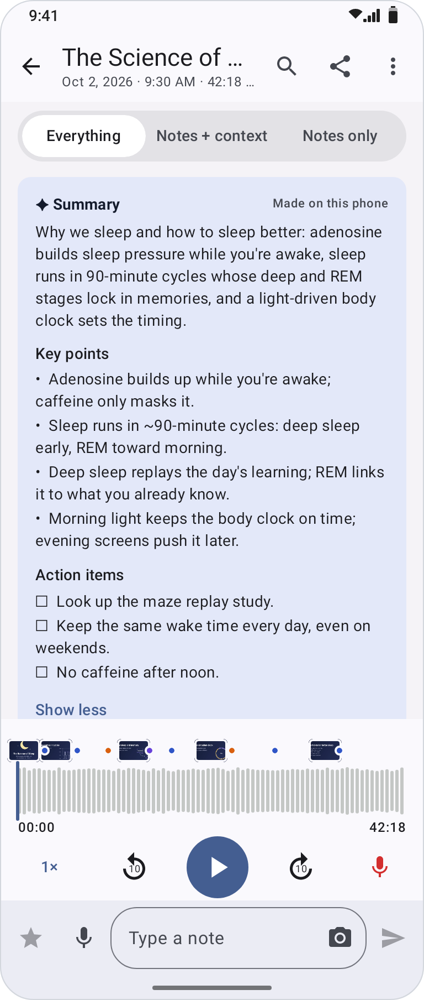
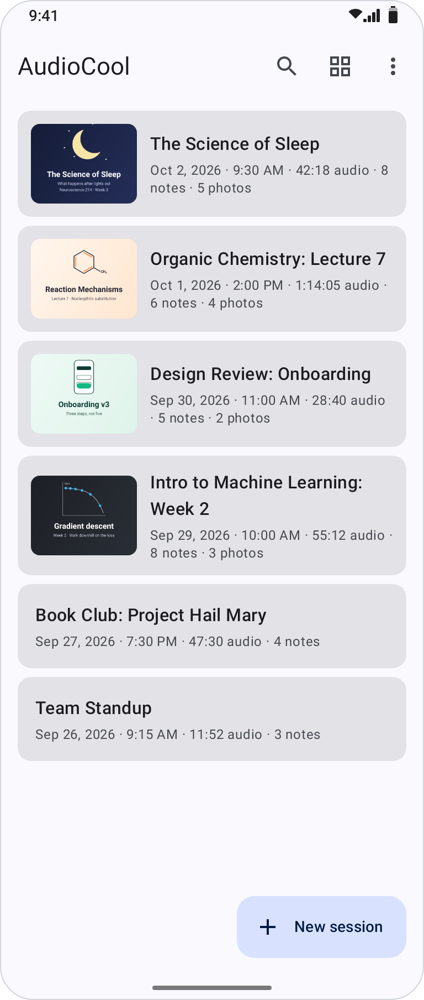
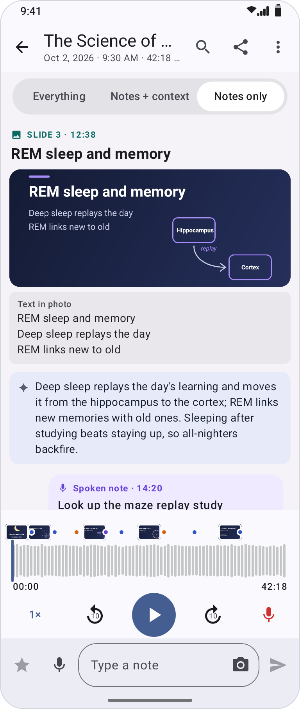
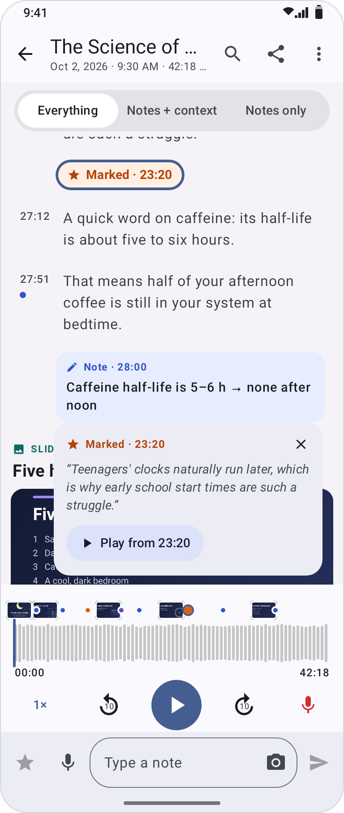
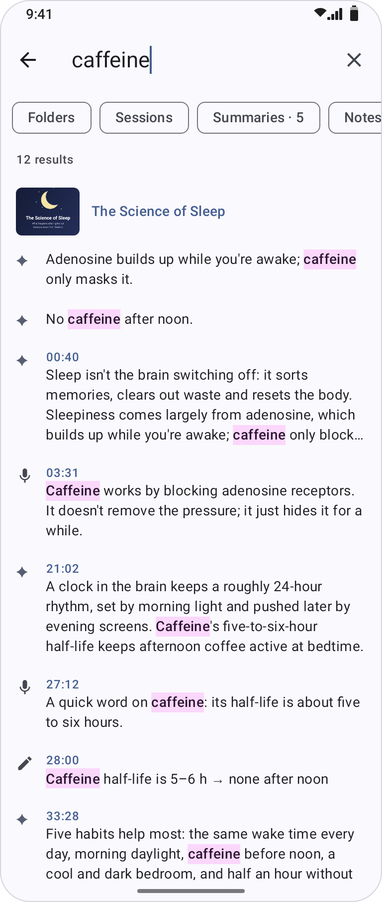
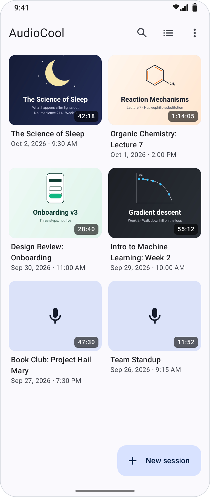
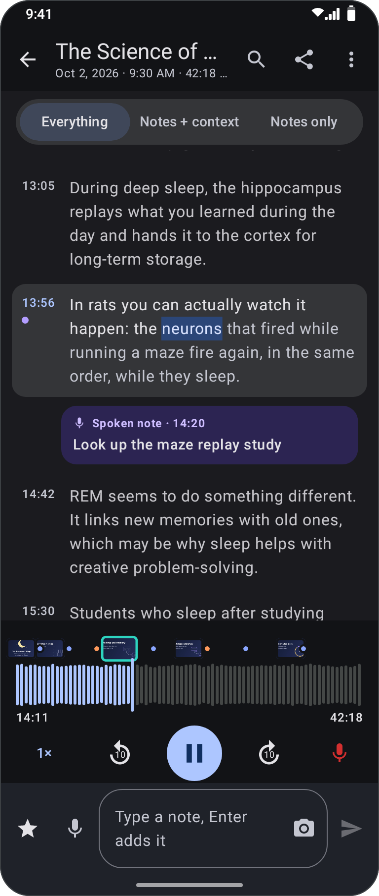

<p align="center">
  
</p>

<h1 align="center">AudioCool</h1>

<p align="center">
  <b>Record a talk, type your notes, and tap any note to hear that moment again.</b><br>
  Live transcripts, slide photos and summaries, all made on your phone.
</p>

<p align="center">
  <a href="https://github.com/ZENinjaneer/audiocool/releases/latest/download/AudioCool.apk"><b>Download for Android</b></a>
  &nbsp;·&nbsp;
  <a href="#install">Install</a>
  &nbsp;·&nbsp;
  <a href="docs/FEATURES.md">All features</a>
  &nbsp;·&nbsp;
  <a href="desktop/README.md">Desktop companion</a>
</p>

<p align="center">
  
  &nbsp;
  
  &nbsp;
  
</p>

## What it does

- **Notes that remember the moment.** Each note is linked to the second you started typing it. Tap
  it later to hear what was being said.
- **Live transcript.** NVIDIA's Parakeet model writes down what's said as you record, right on
  your phone.
- **Slides become chapters.** Snap a slide and it lands where it was shown. Its text is read, made
  searchable, and used to name the session.
- **One timeline.** What was said, your notes, ★ marks and photos, in order. Show everything, notes
  with the talk around them, or just your notes.
- **A waveform to scrub.** Drag through the recording, or tap a marker for a quick preview before
  you jump there.
- **Summaries.** A few sentences under each slide, and a summary of the whole session with key
  points and action items, written on the phone by Google's Gemma 4.
- **Folders.** Keep each course or project together. The summary model can suggest folders, and file
  new sessions as they're summarized.
- **Search everything.** Folders, session names, summaries, notes, slide text and every word said,
  with filters to narrow it down.
- **Lock-screen controls.** Mark a moment, pause, stop or photograph a slide without unlocking.
- **Spoken notes.** Hold the mic and say a note, through a headset if you like, while the phone
  keeps recording the room.
- **Backups and sharing.** Automatic backups to a folder you pick, and sharing as Markdown with the
  audio and photos.

[More about each feature →](docs/FEATURES.md)

## Screenshots

<table>
  <tr>
    <td align="center"><br><sub>Sessions, named after their slides</sub></td>
    <td align="center"><br><sub>Notes only reads like a short version</sub></td>
    <td align="center"><br><sub>Tap a marker to preview it</sub></td>
  </tr>
  <tr>
    <td align="center"><br><sub>Search everything, or pick what to search</sub></td>
    <td align="center"><br><sub>Or browse them as a gallery</sub></td>
    <td align="center"><br><sub>Dark mode</sub></td>
  </tr>
</table>

## Private by design

Recording, transcription, reading slides and summarizing all happen on your phone. The models are
downloaded once, and nothing leaves the phone unless you send it: to your own PC, to a backup folder
you choose, or to whoever you share a session with.

## Install

1. On your Android phone (Android 8 or later), download
   **[AudioCool.apk](https://github.com/ZENinjaneer/audiocool/releases/latest/download/AudioCool.apk)**.
2. Open it, and allow installs from your browser when Android asks.
3. On a Samsung phone, turn off Auto Blocker (Settings › Security and privacy) while you install.

New versions install over the old one and keep your recordings.
**[AudioCool Updater](https://github.com/ZENinjaneer/audiocool/releases/download/updater-1.0/AudioCoolUpdater.apk)**
installs the latest release in one tap, and tells you why if Android refuses. Use it if a browser
download misbehaves: Chrome has been seen to stall at 100%, which Android then reports as "package
appears to be invalid".

On first use, the app offers two optional downloads, best done on Wi-Fi: the speech model for
transcripts (660 MB) and the summary model (2.6 GB).

## AudioCool Desktop

A companion that runs on your PC ([`desktop/`](desktop/README.md)). Pair it with the phone over
Wi-Fi, and it transcribes your sessions with bigger models on your graphics card, sends the
transcripts back to the phone, and lets you browse, search and export everything in a browser.

## Build from source

```sh
export JAVA_HOME=/path/to/jdk-17-or-later ANDROID_HOME=~/Android/Sdk
./gradlew testDebugUnitTest assembleRelease
```

[docs/DEVELOPMENT.md](docs/DEVELOPMENT.md) covers the optional engine tests, model benchmarks,
transcription accuracy, redrawing these screenshots, and signing.

## Credits

- [sherpa-onnx](https://github.com/k2-fsa/sherpa-onnx) (Apache-2.0), fetched at build time.
- [NVIDIA Parakeet](https://huggingface.co/nvidia/parakeet-unified-en-0.6b) speech model, converted
  for sherpa-onnx and downloaded by the app on first use. Licensed by NVIDIA Corporation under the
  [NVIDIA Open Model License](https://www.nvidia.com/en-us/agreements/enterprise-software/nvidia-open-model-license/).
- [Gemma 4 E2B](https://huggingface.co/google/gemma-4-E2B-it) (Apache-2.0), run by
  [LiteRT-LM](https://developers.google.com/edge/litert-lm/android) and downloaded by the app for
  summaries.
- [Silero VAD](https://github.com/snakers4/silero-vad) and [GTCRN](https://github.com/Xiaobin-Rong/gtcrn)
  (both MIT) models, in `app/src/main/assets/`.
- [ML Kit text recognition](https://developers.google.com/ml-kit/vision/text-recognition/v2) (Latin
  script, bundled), for the text in photos.
