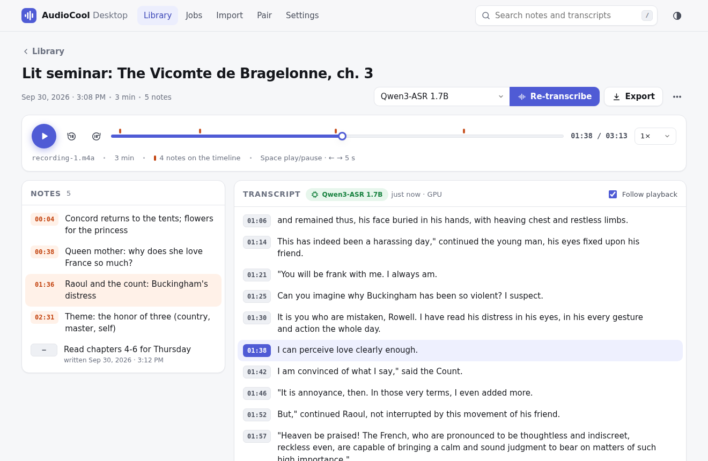
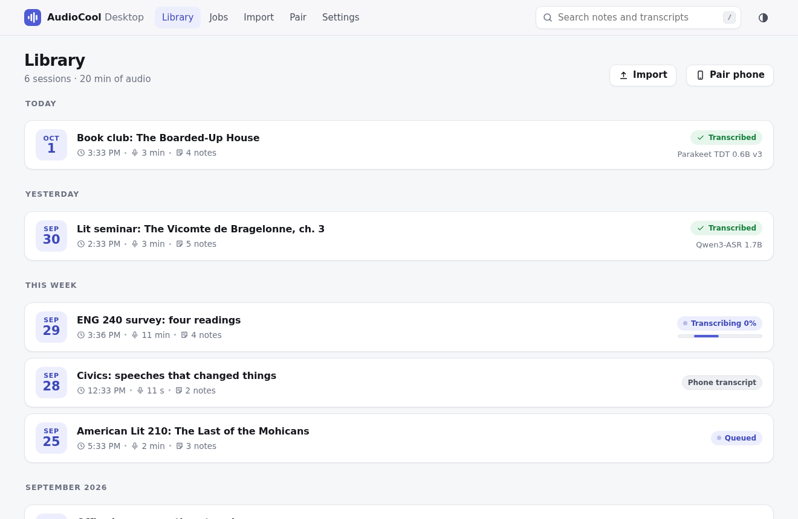
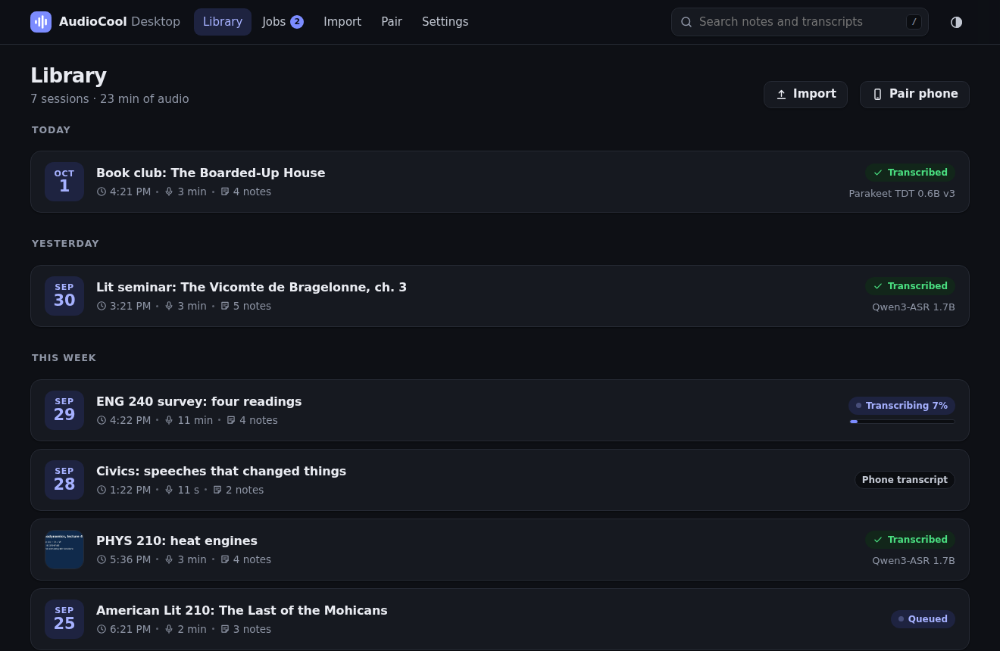
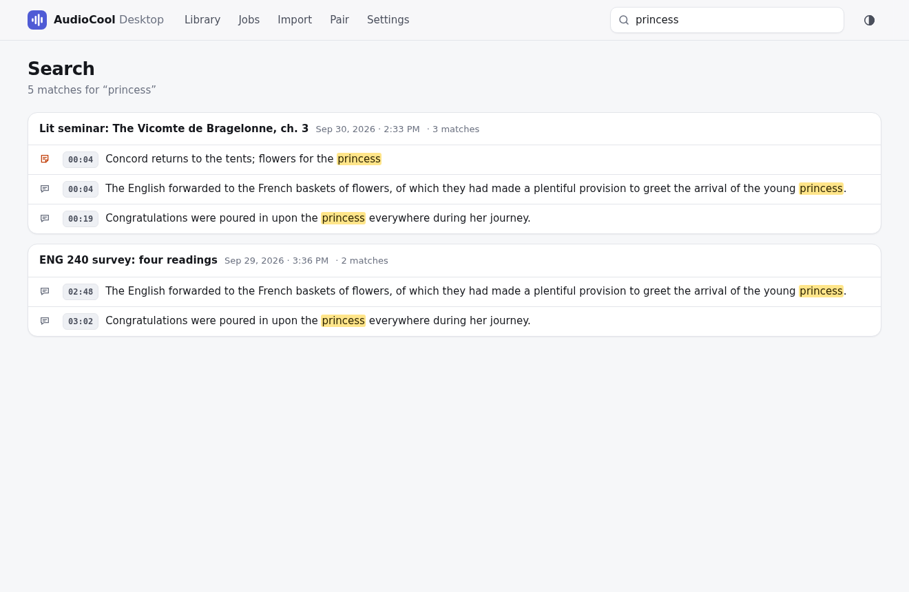
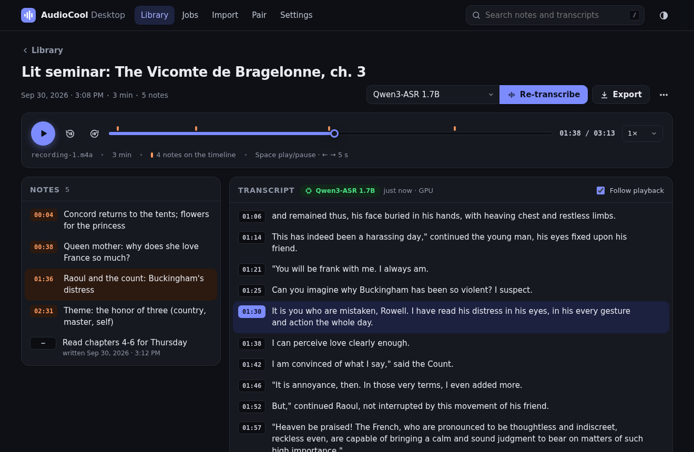
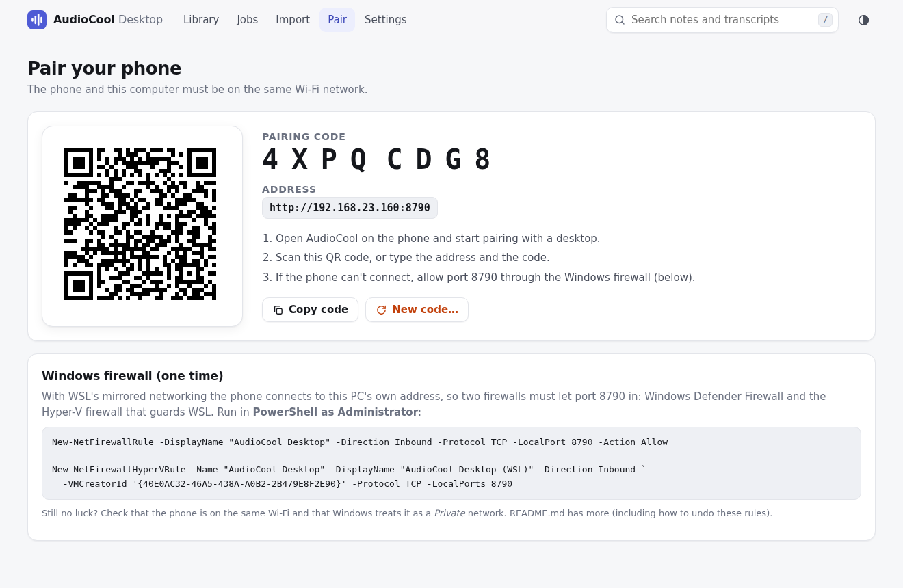
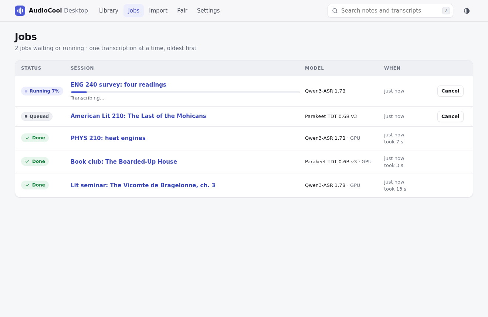

# AudioCool Desktop

A companion for the AudioCool Android app that runs on your PC. Over the same Wi-Fi, the phone
sends its recording sessions (audio plus timestamped notes) to the desktop; the desktop
transcribes them with much larger speech models on the GPU and sends the better transcripts
back. In the browser you can browse, play, search and export everything.



- **Library** in the phone's backup layout (one folder per session), so a phone backup folder can
  be imported or used directly as the library.
- **Transcription** with Qwen3-ASR 1.7B (most accurate open model on the Open ASR Leaderboard),
  NVIDIA Parakeet TDT 0.6B v3 (fast) or Parakeet on the CPU; sentence-level lines with accurate
  start and end times.
- **Web UI** (this computer only): library, search with highlighted hits, a player with note
  markers, a transcript that follows playback, inline editing, import, export (Markdown, SRT,
  TXT), pairing with a QR code, and the job queue.
- **Phone API** on port 8765, protected by the pairing code.

## Run it

```sh
cd desktop
./run.sh
```

The first run creates `desktop/.venv`, installs PyTorch with CUDA 12.8 (needed for the RTX 50xx /
Blackwell GPUs; the CPU build is installed if there's no NVIDIA GPU) and the other dependencies,
and starts downloading the default model (about 6 GB, into `desktop/.cache/huggingface`). It uses
[uv](https://docs.astral.sh/uv/) when it's installed (faster), pip otherwise. Then it prints:

```
────────────────────────────────────────────────────────────────
  AudioCool Desktop 1.0.0
────────────────────────────────────────────────────────────────
  Web UI (this computer):   http://localhost:8765/
  Phone URL (same Wi-Fi):   http://192.168.23.160:8765
  Pairing code:             FC5BKVJB
  Library:                  /home/you/AudioCool Library
  GPU:                      NVIDIA GeForce RTX 5090 Laptop GPU (CUDA)
  Default model:            Qwen3-ASR 1.7B
────────────────────────────────────────────────────────────────
```

Open the web UI, go to **Pair** and scan the QR code with the phone (or type the address and the
code). Ctrl+C stops the server; the job queue picks up where it left off on the next start.

Options (`./run.sh --help`): `--port`, `--host`, `--library DIR` (for this run only),
`--home DIR` (settings folder), `--no-prefetch`. Also `./run.sh test` and `./run.sh benchmark`.

| Setting | Where |
|---|---|
| Pairing code, library folder, computer name, default model | `~/.config/audiocool-desktop/config.json` (change them on the Settings/Pair pages); `$AUDIOCOOL_HOME` moves this folder |
| Job queue | `~/.config/audiocool-desktop/jobs.db` (SQLite) |
| Library | `~/AudioCool Library` by default; `--library` / `$AUDIOCOOL_LIBRARY` override it for one run |
| Models | `desktop/.cache/huggingface`, or your own `$HF_HOME` |

If port 8765 is taken, `run.sh` says so and exits (the phone expects 8765; `--port` picks
another for testing).

## Let the phone in: Windows firewall (WSL2, mirrored networking)

With `networkingMode=mirrored`, WSL shares the Windows network interfaces, so the server (bound to
0.0.0.0 in WSL) is reachable at the Windows host's LAN address. Two firewalls sit in the way:
Windows Defender Firewall and the Hyper-V firewall that filters traffic into WSL. Open
**PowerShell as Administrator** and run:

```powershell
# Windows Defender Firewall
New-NetFirewallRule -DisplayName "AudioCool Desktop" -Direction Inbound -Protocol TCP -LocalPort 8765 -Action Allow

# Hyper-V firewall for WSL ({40E0AC32-...} is WSL's VM creator id)
New-NetFirewallHyperVRule -Name "AudioCool-Desktop" -DisplayName "AudioCool Desktop (WSL)" -Direction Inbound `
  -VMCreatorId '{40E0AC32-46A5-438A-A0B2-2B479E8F2E90}' -Protocol TCP -LocalPorts 8765
```

Add `-Profile Private` to the first rule to allow it on private networks only (then Windows must
treat your Wi-Fi as a private network). Alternatively, allow all inbound connections to WSL with
`Set-NetFirewallHyperVVMSetting -Name '{40E0AC32-46A5-438A-A0B2-2B479E8F2E90}' -DefaultInboundAction Allow`.

To check: open `http://<PC address>:8765/api/v1/ping` in the phone's browser. A JSON
`{"error":"missing or wrong pairing code"}` means the phone can reach the server.

To undo:

```powershell
Remove-NetFirewallRule -DisplayName "AudioCool Desktop"
Remove-NetFirewallHyperVRule -Name "AudioCool-Desktop"
```

The phone must be on the same network as the PC (not a guest network that isolates clients).
The web UI only opens on the PC itself; other devices get only the token-protected API.

## The library

```
~/AudioCool Library/
  2026-09-22_15-05_a1b2c3d4e5f6/      start time (local) + session id, as the phone names backups
    session.json                      the session, with the best transcripts merged in
    recording-1.m4a                   audio exactly as the phone recorded it
    notes.md                          notes and transcript, readable without the app
    audiocool-desktop.json            desktop-only data (see below)
```

`audiocool-desktop.json` holds what the desktop owns: transcripts made on the desktop (per
recording, with the model that made them, the audio length and timings), corrections made in
the web UI, a title changed in the web UI, and cached audio lengths. The phone never writes it,
so when the phone sends a session again (or overwrites `session.json` in a shared folder), the
desktop's transcripts survive and are merged back in. `session.json` stays in the phone's format
(plus a `transcriptModel` field on transcribed recordings, which the phone ignores), so a library
folder can also go back into the phone's backup folder.

**Import** (web UI): a phone backup folder (or one session folder) by path, e.g.
`/mnt/c/Users/you/Documents/AudioCool Backup`, or a zip of it by drag and drop. Existing sessions
are updated when the imported copy is newer; audio the library lacks is copied; desktop
transcripts are kept. Or set the library folder (Settings) to the backup folder itself.

## Models

Chosen from the [Open ASR Leaderboard](https://huggingface.co/spaces/hf-audio/open_asr_leaderboard)
as of 25 Sept 2026. The best open-weights English models there are Qwen3-ASR 1.7B (4.31 % mean
WER), Hojo-ASR (4.33 %), Higgs Audio v3 STT (4.39 %) and Canary-Qwen 2.5B (4.43 %); Parakeet TDT
0.6B v2/v3 sit at 4.7–4.9 % with ~15x the throughput; Whisper large-v3 is at 5.78 %.

| Id | Model | Use | Runs on |
|---|---|---|---|
| `qwen3-asr-1.7b` (default) | [Qwen3-ASR 1.7B](https://huggingface.co/Qwen/Qwen3-ASR-1.7B-hf) + [Qwen3-ForcedAligner 0.6B](https://huggingface.co/Qwen/Qwen3-ForcedAligner-0.6B-hf) | Most accurate | GPU (bf16), else CPU |
| `parakeet-tdt-0.6b-v3` | [NVIDIA Parakeet TDT 0.6B v3](https://huggingface.co/nvidia/parakeet-tdt-0.6b-v3) | Fast, nearly as accurate | GPU (bf16), else CPU |
| `parakeet-tdt-0.6b-v3-cpu` | the same Parakeet | Keeps the GPU free; the default when there's no GPU | CPU (fp32) |

All three run through Hugging Face Transformers 5.18 (no NeMo, no system ffmpeg). Qwen3-ASR
writes punctuated, cased text but no times, so the Qwen3 forced aligner places every word (80 ms
resolution); Parakeet's transducer gives token times itself.

**Pipeline.** PyAV (bundled FFmpeg) decodes the AAC (ADTS or MP4) to 16 kHz mono → Silero VAD
finds speech (an hour is scored in 1–2 s by running 64 stretches of the recording side by side)
→ speech is cut at pauses into chunks of up to 30 s → batches of chunks go through the model →
word times → hesitation sounds ("uh", "um") are dropped → words are grouped into lines: sentences,
split at the best pause or comma when longer than about 12–20 s, and short ones merged with a
neighbour (lines are at most 20 s and at least 2 s unless a short phrase stands alone between long
pauses; the median is 4–6 s on talks). Start and end times come from the first and last word, so
clicking a line starts right where it was said.

**GPU and fallback.** Only one model is loaded at a time, and it's unloaded after 10 idle minutes.
If CUDA fails during a job (out of memory, driver error), the job is retried on the CPU and the
job list says so. Without CUDA, the CPU Parakeet is the default.

### Measured speed and accuracy

RTX 5090 Laptop GPU (24 GB), Core Ultra 9 275HX, PyTorch 2.8 (CUDA 12.8). Three TED talks from the
TED-LIUM long-form test set (59.8 min in total), re-encoded the way the phone records (AAC in
MP4, mono, 44.1 kHz, 96 kbps), so times include decoding the phone file and VAD. Model loading
(3–7 s, once) is excluded. WER uses simple normalization (lowercase, punctuation stripped), as
asked; the second WER column uses Whisper's English normalizer (what the leaderboard uses), which
also reconciles numbers ("1900s" vs "nineteen hundreds", "CO2" vs "co two"), the bulk of the
"errors" under simple normalization.

| Model | Talk | Length | WER (simple) | WER (Whisper norm.) | Time | Speed |
|---|---|---|---|---|---|---|
| Qwen3-ASR 1.7B (GPU) | Aimee Mullins | 20.8 min | 3.24 % | 2.02 % | 11.1 s | 113x real time |
| | Bill Gates | 25.1 min | 4.97 % | 2.43 % | 14.9 s | 101x |
| | Dan Barber | 13.9 min | 5.16 % | 2.61 % | 12.0 s | 69x |
| | **all three** | 59.8 min | **4.50 %** | **2.35 %** | 38.0 s | **94x** (RTF 0.011) |
| Parakeet TDT 0.6B v3 (GPU) | Aimee Mullins | 20.8 min | 4.04 % | 2.42 % | 3.3 s | 381x |
| | Bill Gates | 25.1 min | 5.57 % | 2.86 % | 3.4 s | 443x |
| | Dan Barber | 13.9 min | 7.18 % | 3.02 % | 1.8 s | 467x |
| | **all three** | 59.8 min | **5.51 %** | **2.77 %** | 8.5 s | **424x** (RTF 0.0024) |
| Parakeet TDT 0.6B v3 (CPU, 24 threads) | Aimee Mullins | 20.8 min | 4.04 % | 2.42 % | 30.4 s | 41x (RTF 0.024) |

So an hour-long lecture takes about 40 s with Qwen3-ASR, under 10 s with Parakeet on the GPU and
about 1.5 min on the CPU. End to end through the phone API (`tools/fake_phone.py`), a 60-minute
recording (44 MB .m4a) uploaded in 0.3 s and its Qwen3-ASR job finished in 36 s including loading
the model, giving 583 lines. Peak GPU memory: 11.5 GB (Qwen3-ASR, batches of 24 × 30 s), 6.1 GB
(Parakeet). Qwen3-ASR also runs on the CPU (the fallback after a GPU failure), but only at about
real time (11 s clip in 9 s). Reproduce with `./run.sh benchmark --rows 0 1 2`
(`pip install whisper-normalizer` adds the second WER column).

## API (phone)

Base URL `http://<PC address>:8765`. JSON in and out unless noted. Every `/api/v1` route needs
`Authorization: Bearer <pairing code>`; without it (or with a wrong one) the answer is
`401 {"error": "missing or wrong pairing code"}`. Errors are `{"error": "<message>"}` with 400
(bad input) or 404 (unknown session or file).

The pairing code is 8 characters from `ABCDEFGHJKMNPQRSTUVWXYZ23456789`, made on first run and
kept in the config file; the Pair page shows it and can make a new one. The QR code on the Pair
page contains `audiocool://pair?url=<url-encoded http://LAN-IP:8765>&token=<code>`; the LAN
addresses are the private IPv4 addresses (192.168/16, 10/8, 172.16/12) of real Wi-Fi/Ethernet
adapters, the one with the default route first.

**`GET /api/v1/ping`**

```json
{"app": "audiocool-desktop", "version": "1.0", "name": "Legion",
 "models": [{"id": "qwen3-asr-1.7b", "name": "Qwen3-ASR 1.7B", "default": true},
            {"id": "parakeet-tdt-0.6b-v3", "name": "Parakeet TDT 0.6B v3", "default": false},
            {"id": "parakeet-tdt-0.6b-v3-cpu", "name": "Parakeet TDT 0.6B v3 (CPU)", "default": false}]}
```

**`GET /api/v1/sessions`** — every session in the library, newest first.

```json
{"sessions": [{"id": "a1b2c3d4e5f6", "title": "Bio 101", "createdAt": 1790000000000, "updatedAt": 1790000000000,
               "recordings": [{"id": "r1", "durationMs": 3600000, "transcribed": true, "model": "qwen3-asr-1.7b"}]}]}
```

`transcribed`/`model` describe the desktop's own transcript of that recording (a transcript that
came from the phone doesn't count).

**`PUT /api/v1/sessions/{id}`** — body `{"session": <session.json>, "files": {"recording-1.m4a": <bytes>, ...}}`.
Stores or updates the session and answers `{"needed": ["recording-1.m4a"]}`: the files listed in
`files` that the session references and that the desktop doesn't have at that size. Files the
phone doesn't list (e.g. a recording still in progress) are never needed; names in `files` that
the session doesn't reference are ignored. The phone's metadata (title, notes, recordings,
`updatedAt`) replaces what the desktop had, except that transcripts made on the desktop are
kept (the phone's transcript of such a recording is discarded), and a title edited on the desktop
is kept until the phone sends a different title than the one the edit replaced. Unknown fields are
kept. A renamed file (`recording-1.aac` → `recording-1.m4a`) is simply needed; the old file keeps
playing until the new one arrives and is then deleted. 400 for malformed sessions: `session.id`
must match the URL (letters, digits, `-`, `_`, max 64), files must be named `recording-N.aac` or
`recording-N.m4a`, recording ids unique, numbers numeric.

**`PUT /api/v1/sessions/{id}/files/{name}`** — raw bytes (any content type) → `204`. The name
must match `recording-\d+\.(aac|m4a)` (else 400) and be a file of that session (else 404; 404
also for an unknown session). The body is streamed to a temporary file in the session folder,
synced and renamed into place, so a few hundred MB need no memory and an interrupted upload
leaves the previous file untouched (a `Content-Length` mismatch is a 400). If the new audio's
length differs from the audio a desktop transcript was made from by more than 2 s, that
transcript is dropped.

**`POST /api/v1/sessions/{id}/transcribe`** — body `{"model": "<id>" | null, "recordingIds": [...] | null}`
(the body may be empty) → `202 {"jobs": [{"id": "5f2c9a0e1b7d", "recordingId": "r1", "model": "qwen3-asr-1.7b", "status": "queued"}]}`.
`null` model = the default model; `null` recordings = every recording whose audio is uploaded.
400 for an unknown model or recording, for a listed recording whose audio isn't uploaded yet, or
when no recording has audio; 404 for an unknown session. Asking again for a recording and model
that are already queued or running returns that job (its status may then be `running`).

**`GET /api/v1/sessions/{id}`**

```json
{"session": {"version": 1, "id": "a1b2c3d4e5f6", "...": "session.json, with each recording's transcript replaced by the desktop's when there is one"},
 "transcriptModels": {"r1": "qwen3-asr-1.7b"},
 "jobs": [{"id": "5f2c9a0e1b7d", "recordingId": "r1", "model": "qwen3-asr-1.7b", "status": "running", "progress": 0.42, "error": null}]}
```

`jobs` lists this session's jobs, oldest first (the newest 500 finished jobs are kept overall).
Status is `queued`, `running`, `done` or `error` (a job cancelled in the web UI ends as `error`
with `"error": "Cancelled"`). Jobs run one at a time, oldest first, on a background worker; the
queue is in SQLite, and a job interrupted by a restart runs again.

Transcript segments are `{"s": <ms>, "e": <ms>, "t": "<text>"}`, from the start of the
recording's file, 2–20 s long, punctuated and cased.

### Differences from the original contract

None in request/response shapes or status codes. Choices the contract left open:

- The pairing code is accepted in any letter case and with spaces or dashes. After 10 failed
  attempts in a minute from one address, each further 401 is delayed by a second.
- An unknown recording id in `recordingIds` is a 400 (bad input), not a 404.
- `transcribe` answers with the existing job (possibly `running`) for a recording and model that
  are already queued or running, instead of queuing a duplicate.
- `GET /api/v1/sessions/{id}` returns the title as the desktop has it (a title edited in the web UI
  wins until the phone renames the session).
- "Localhost only" for the web UI means requests from this computer: loopback, or one of the PC's
  own addresses (e.g. opening `http://192.168.x.x:8765/` on the PC itself).

## Web UI

Served at `http://localhost:8765/` to this computer only (loopback or the PC's own addresses,
with a matching `Host` header, so other sites can't reach it through DNS rebinding); requests that
change something must carry an `X-AudioCool: 1` header (a cross-site page can't send it without a
CORS preflight, which is never approved). Plain HTML/CSS/JS in `audiocool_desktop/static`, no
build step, no CDN: it works offline.

- **Library**: sessions grouped by date with duration, note count and transcription status
  (live progress while transcribing).
- **Search** (top bar, or press `/`): every word must match, case- and accent-insensitive, in
  notes, transcripts and titles; hits are highlighted, and clicking one opens the session and
  plays from that moment.
- **Session**: player with note markers on the seek bar (hover for the note, click to play from
  just before it), speed control, keyboard (`Space`, `←`/`→`); notes with timestamps (click to
  play); transcript with timestamps, current line highlighted and followed during playback
  (scrolling by hand pauses following), the model that made it, and inline editing (double-click
  a line or use the pencil; Enter saves, Esc cancels); the title is editable in place;
  "Transcribe" with a model picker and live progress; export as Markdown, plain text or SRT.
- **Import**, **Pair** (QR code, code, LAN URLs, new code, firewall help), **Jobs** (queue with
  progress, cancel), **Settings** (computer name shown to the phone, default model, library
  folder, model status).
- Light and dark (follows the system; the button in the top bar switches), works at phone width.

| | |
|---|---|
|  |  |
|  |  |
|  |  |

All screenshots (light and dark, plus one at phone width) are in
[docs/screenshots](docs/screenshots); they come from a demo instance on port 8790, filled through
the phone API with `tools/fake_phone.py`, using LibriSpeech recordings (CC BY 4.0) of
public-domain books.

## Tests

```sh
./run.sh test                 # everything, ~15 s with the GPU
./run.sh test -m "not slow"   # without the real speech model
```

They cover the API (auth on every route, every endpoint, validation and error codes), uploads
(the needed-files logic, renames, atomic replacement, an interrupted upload, a 320 MB upload
streamed through a real server while memory stays flat), the job lifecycle and queue with a fake
engine (order, deduplication, persistence across a restart, errors, cancel, falling back to the
CPU after a CUDA error), AAC decoding of both containers (files made with PyAV), the web UI's API
(search, exports, edits, ranges, import, settings) and one end-to-end run of the phone's calls with
the real default model on a short real clip (JFK's "ask not what your country can do for you",
public domain, `tests/data/jfk.m4a`).

## Tools

- `tools/benchmark.py`: speed and WER on TED-LIUM long-form talks or your own audio.
- `tools/fake_phone.py`: plays the phone against a running server (send a session with notes,
  upload, transcribe, print the transcript), handy for trying the API.
- `tools/screenshots.py`: screenshots of every page, light and dark (needs `pip install playwright`
  and `playwright install chromium`).

## Code map

| | |
|---|---|
| `audiocool_desktop/server.py` | HTTP routes (phone API, web UI API), auth, uploads, import |
| `audiocool_desktop/library.py` | library folders, merging desktop data into sessions, imports |
| `audiocool_desktop/jobs.py` | SQLite job queue and the worker thread |
| `audiocool_desktop/engines/` | models (`qwen3.py`, `parakeet.py`), VAD and chunking (`vad.py`), lines (`segmenter.py`) |
| `audiocool_desktop/sessionfmt.py` | session.json validation, Markdown/SRT/TXT exports |
| `audiocool_desktop/audio.py` | AAC decoding/encoding with PyAV |
| `audiocool_desktop/netinfo.py` | LAN address detection |
| `audiocool_desktop/static/` | the web UI |

## Limitations

- English only by default (Qwen3-ASR is told the language is English; the aligner supports 11
  languages, Parakeet v3 25 European languages).
- One transcription at a time; a long queue on the CPU takes a while.
- Search scans the library in memory (fine for thousands of sessions, not millions).
- The web UI has no login: it relies on being reachable only from this computer.
- Speaker labels (diarization) aren't produced.
